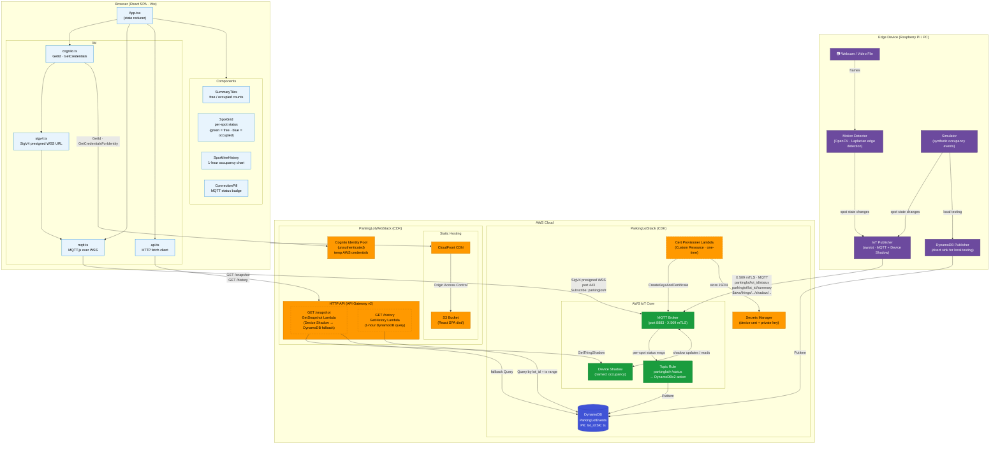

# Architecture Diagram



## Component Overview

| Layer | Component | Role |
|-------|-----------|------|
| **Edge** | Motion Detector | OpenCV + Laplacian edge detection to classify each parking spot as free/occupied |
| **Edge** | Simulator | Generates synthetic occupancy events for testing without a camera |
| **Edge** | IoT Publisher | Sends per-spot status via MQTT + keeps Device Shadow up-to-date |
| **IoT Core** | MQTT Broker | Receives device messages over TLS 1.3 with X.509 mutual auth |
| **IoT Core** | Device Shadow | Stores the latest full occupancy snapshot (named shadow: `occupancy`) |
| **IoT Core** | Topic Rule | Fans per-spot status messages into DynamoDB via a DynamoDBv2 action |
| **DynamoDB** | ParkingLotEvents | Time-series event log (PK: `lot_id`, SK: `ts`) with TTL for auto-expiry |
| **Lambda** | GetSnapshot | Returns Device Shadow; falls back to DynamoDB reconstruction if shadow unavailable |
| **Lambda** | GetHistory | Queries DynamoDB for a 1-hour window to feed the sparkline chart |
| **Cognito** | Identity Pool | Issues temporary AWS credentials to anonymous browser users |
| **CloudFront + S3** | Static Hosting | Serves the React SPA globally with OAC-protected S3 origin |
| **Browser** | React SPA | Displays live spot grid, summary tiles, and sparkline via MQTT + HTTP API |
| **Browser** | mqtt.ts | MQTT.js over SigV4-presigned WSS — subscribes to live status + summary topics |

## Key Data Flows

```
Device → IoT Core → DynamoDB           (persistent event log via Topic Rule)
Device → IoT Core Device Shadow        (latest snapshot, always current)
Browser → Cognito → SigV4 → MQTT WSS  (live push updates, read-only)
Browser → API Gateway → Lambda → Shadow / DynamoDB  (initial load + history)
```
